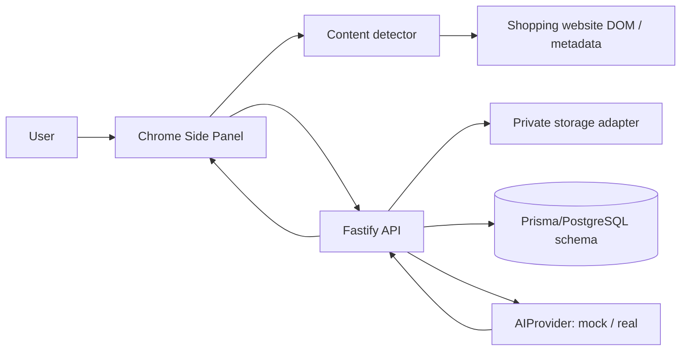

# WearWise — AI Virtual Try-On

WearWise is a Manifest V3 Chrome Side Panel application with reusable profile photographs and generic product detection. The default provider is local CatVTON. When enabled, cloud failover runs in this order: **CatVTON → Gemini → OpenAI**. Mock mode is explicitly selected with `AI_PROVIDER=mock` and does not generate a real try-on.

## Architecture



The side panel requests a typed scan message from a generic content script. The script combines JSON-LD Product records, OpenGraph data and scored visible images/cards. The backend validates profile uploads, keeps files private behind an API route, verifies category asset requirements, and submits work through `AIProvider`.

## Quick start

Requirements: Node.js 22+ and npm 10+. For real local generation, follow [CatVTON setup](services/catvton/README.md) and keep its service running on port 8788. The Node backend alone does not load the GPU model.

```bash
cp .env.example .env
npm install
npm run dev
```

Open `chrome://extensions`, enable Developer mode, choose **Load unpacked**, then select `apps/extension/dist` after running:

```bash
npm run build:extension
```

The backend defaults to `http://localhost:8787`. The manifest's content script currently matches all websites; scans are requested for the active tab. The backend host permission is limited to localhost. Reload the unpacked extension after rebuilding.

## Commands

```bash
npm run build
npm run test
npm run lint
```

## Real AI configuration

Set `AI_PROVIDER=auto` for local CatVTON. To enable the requested Gemini → OpenAI fallbacks, set `ALLOW_CLOUD_FALLBACK=true` and supply `GEMINI_API_KEY` and `OPENAI_API_KEY` in the root `.env`. Missing keys are skipped; credentials never enter the extension. Cloud fallback sends profile/product photographs to those providers and can incur API charges. No paid calls are made during automated tests. Existing `.env` files are not overwritten; change an old `AI_PROVIDER=mock` value yourself.

CatVTON handles tops, pants and dresses with the original background. Shoes, jewellery, accessories, and background changes skip local inference and require a configured cloud provider. Fallback applies to service errors/timeouts; policy refusals are terminal. Cancellation prevents another provider from starting, but an already submitted cloud request can still be billed and a running GPU kernel can finish. Success stops the chain immediately. See [provider details](docs/ai-pipeline.md).

The previous FASHN adapter remains selectable with `AI_PROVIDER=fashn`, outside the automatic chain. The default chain never substitutes mock output on failure.

## Privacy and limitations

Profile and result files are private backend resources; URLs are served through `/api/files` and are not public object-store links. Production must add authenticated sessions, HTTPS, a real database migration and signed object-store URLs. Uploaded photos are never used for AI training by this application. Product extraction cannot overcome site access controls, can miss client-rendered products, and generated visuals are not a fit or sizing guarantee.

See [setup](docs/setup.md), [architecture](docs/architecture.md), [detection](docs/product-detection.md), [AI pipeline](docs/ai-pipeline.md), [privacy](docs/privacy-security.md), [testing](docs/testing.md), and [the demo guide](docs/demonstration.md).
